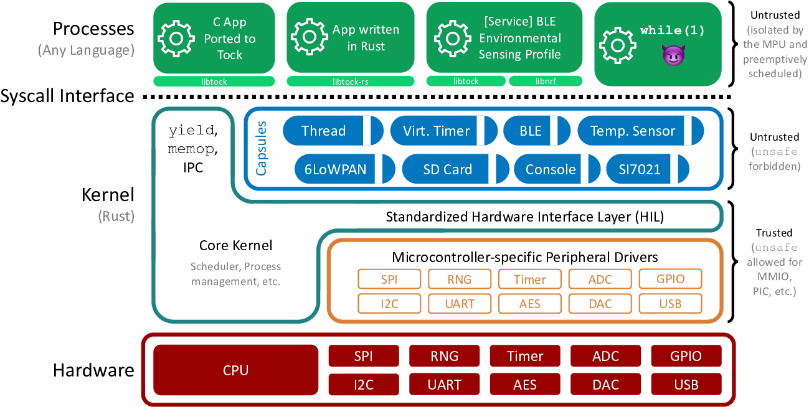

# Tock Overview

Tock is a secure, embedded operating system for Cortex-M and RISC-V
microcontrollers. Tock assumes the hardware includes a memory protection unit
(MPU), as systems without an MPU cannot simultaneously support untrusted
processes and retain Tock's safety and security properties. The Tock kernel and
its extensions (called _capsules_) are written in Rust.

Tock can run multiple, independent untrusted processes written in any language.
The number of processes Tock can simultaneously support is constrained by MCU
flash and RAM. Tock can be configured to use different scheduling algorithms,
but the default Tock scheduler is preemptive and uses a round-robin policy. Tock
uses a microkernel architecture: complex drivers and services are often
implemented as untrusted processes, which other processes, such as applications,
can invoke through inter-process commmunication (IPC).

This document gives an overview of Tock's architecture, the different classes of
code in Tock, the protection mechanisms it uses, and how this structure is
reflected in the software's directory structure.

## Tock Architecture

The above Figure shows Tock's architecture. Code falls into one of three
categories: the _core kernel_, _capsules_, and _processes_.

The core kernel and capsules are both written in Rust. Rust is a type-safe
systems language; other documents discuss the language and its implications to
kernel design in greater detail, but the key idea is that Rust code can't use
memory differently than intended (e.g., overflow buffers, forge pointers, or
have pointers to dead stack frames). Because these restrictions prevent many
things that an OS kernel has to do (such as access a peripheral that exists at a
memory address specified in a datasheet), the very small core kernel is allowed
to break them by using "unsafe" Rust code. Capsules, however, cannot use unsafe
features. This means that the core kernel code is very small and carefully
written, while new capsules added to the kernel are safe code and so do not have
to be trusted.

Processes can be written in any language. The kernel protects itself and other
processes from bad process code by using a hardware memory protection unit
(MPU). If a process tries to access memory it's not allowed to, this triggers an
exception. The kernel handles this exception and kills the process.

The kernel provides four major system calls:

- command: makes a call from the process into the kernel
- subscribe: registers a callback in the process for an upcall from the kernel
- allow: gives kernel access to memory in the process
- yield: suspends process until after a callback is invoked

Every system call except yield is non-blocking. Commands that might take a long
time (such as sending a message over a UART) return immediately and issue a
callback when they complete. The yield system call blocks the process until a
callback is invoked; userland code typically implements blocking functions by
invoking a command and then using yield to wait until the callback completes.

The command, subscribe, and allow system calls all take a driver ID as their
first parameter. This indicates which driver in the kernel that system call is
intended for. Drivers are capsules that implement the system call.
