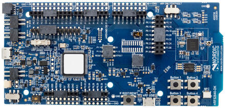

# Security Key Setup

There are a few setup steps you may need to complete to get started with the
security key.

## Hardware Setup



First, you'll need an nRF52840DK board. Other boards that Tock supports should
work though, as long as they have at least one button. You'll also need two USB
cables, one for programming the board and the other for attaching it as a USB
device.

There are a couple of configurations on the nRF52840DK board that you should
double-check:

1. The "Power" switch on the top left should be set to "On".
2. The "nRF power source" switch in the top middle of the board should be set to
   "VDD".
3. The "nRF ONLY | DEFAULT" switch on the bottom right should be set to
   "DEFAULT".

For now, you should plug one USB cable into the top of the board for programming
(NOT into the "nRF USB" port on the side). We'll attach the other USB cable
later.

## Software Setup

If you followed the previous ["Course Setup"](course_setup.md) steps and/or the
["Getting Started" guide](https://github.com/tock/tock/blob/master/doc/Getting_Started.md)
you should have the software you need.

As a reminder though, you'll need:

- Clone of the [Tock repo](https://github.com/tock/tock) (kernel)
- Clone of the [Libtock-C repo](https://github.com/tock/libtock-c) (userland)
- Rust toolchain (compile kernel, need rustup)
- GCC embedded C toolchain (compile userland apps)
- Install of Tockloader (a python tool to upload code to the board)
- Terminal windows and whatever code editor you prefer

## Programming the Kernel

For the first part of the tutorial, you'll need the Tock kernel loaded onto the
nRF52840DK. We'll use a special version of the board that includes some code
we'll use for the tutorial which is located in `boards/nordic/nrf52840dk_demo`.

Let's build the kernel for the board to verify you have the toolchain setup:

```
$ cd tock/boards/nordic/nrf52840dk_demo
$ make
```

You should see the rust compiler build process and things should complete
successfully.

After that has completed, we can upload the kernel to your board:

```
$ make install
```

If everything worked properly, you should see a message that's something like
this:

```
$ make install
    Finished release [optimized + debuginfo] target(s) in 0.33s
   text	   data	    bss	    dec	    hex	filename
 172036	      4	  33100	 205140	  32154	tock/target/thumbv7em-none-eabi/release/nrf52840dk
fbb724085db6dfd7530f792ffc50833108c5f26322f3ff9803363000439857c5  tock/tock/target/thumbv7em-none-eabi/release/nrf52840dk.bin
tockloader  flash --address 0x00000 --board nrf52dk --jlink tock/tock/target/thumbv7em-none-eabi/release/nrf52840dk.bin
[INFO   ] Using settings from KNOWN_BOARDS["nrf52dk"]
[STATUS ] Flashing binary to board...
[INFO   ] Finished in 9.444 seconds
```
